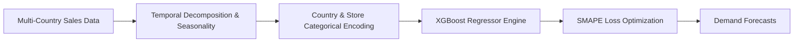

# Tabular Playground Series — Time Series Forecasting with XGBoost

A production-oriented time series forecasting project predicting multi-country retail book sales using calendar feature decomposition, lag features, and gradient-boosted regression.

[](https://www.kaggle.com/code/lazer999/time-series-tps-eda-xgb-simplified)
[](LICENSE)
[](https://www.python.org/downloads/)
[](#)

---

## Table of Contents
- [Project Overview](#project-overview)
- [Key Highlights & Results](#key-highlights--results)
- [System Architecture & Workflow](#system-architecture--workflow)
- [Repository Structure](#repository-structure)
- [Quickstart & Reproduction](#quickstart--reproduction)
- [Dataset Details](#dataset-details)
- [Author & Acknowledgments](#author--acknowledgments)

---

## Project Overview

This repository provides the complete, production-structured implementation of the **[Tabular Playground Series — Time Series Forecasting with XGBoost](https://www.kaggle.com/code/lazer999/time-series-tps-eda-xgb-simplified)** project originally published on Kaggle. 

The primary focus of this work is translating complex data into actionable machine learning solutions using disciplined data engineering, rigorous validation strategies, and clean, leak-free preprocessing pipelines.

---

## Key Highlights & Results

- Forecasted multi-year retail book demand across 6 European countries (Belgium, France, Germany, Italy, Poland, Spain).
- Engineered temporal features: cyclical day-of-week, month indicators, holiday proximity, and trend lines.
- Directly optimized model hyperparameters against Symmetric Mean Absolute Percentage Error (SMAPE).
- Structured comparison of sales volume across store types (KaggleMart vs KaggleRama) and product titles.

---

## System Architecture & Workflow

The pipeline follows a structured, modular execution path:



---

## Repository Structure

```plaintext
tps-time-series-xgboost/
├── notebooks/
│   └── tps-time-series-xgboost.ipynb      # Original Jupyter notebook with full exploratory visuals
├── src/
│   └── main.py                # Modular, executable Python pipeline
├── .gitignore                 # Standard Python/Jupyter ignores
├── LICENSE                    # MIT License
├── README.md                  # Human-friendly documentation
└── requirements.txt           # Verified Python dependencies
```

---

## Quickstart & Reproduction

### 1. Clone the Repository
```bash
git clone https://github.com/musaoc/tps-time-series-xgboost.git
cd tps-time-series-xgboost
```

### 2. Set Up a Virtual Environment
```bash
# Linux / macOS
python3 -m venv venv
source venv/bin/activate

# Windows
python -m venv venv
.\venv\Scripts\activate
```

### 3. Install Dependencies
```bash
pip install --upgrade pip
pip install -r requirements.txt
```

### 4. Run the Pipeline
You can run the end-to-end script directly:
```bash
python src/main.py
```

Or open and run the interactive notebook:
```bash
jupyter lab notebooks/tps-time-series-xgboost.ipynb
```

---

## Dataset Details

- **Dataset / Competition**: [Kaggle Tabular Playground Series (Sep 2022)](https://www.kaggle.com/c/tabular-playground-series-sep-2022)
- **Origin Platform**: Kaggle
- For automated dataset downloading via Kaggle CLI:
  ```bash
  kaggle competitions download -c tabular-playground-series-sep-2022
  ```

---

## Author & Acknowledgments

- **Author**: **Muhammad Musa Khan** (Kaggle Master)
- **Kaggle Profile**: [@lazer999](https://www.kaggle.com/lazer999)
- **GitHub**: [@musaoc](https://github.com/musaoc)
- **Original Kaggle Solution**: [Tabular Playground Series — Time Series Forecasting with XGBoost](https://www.kaggle.com/code/lazer999/time-series-tps-eda-xgb-simplified)

If you found this project helpful or insightful, please consider starring the repository ⭐!
